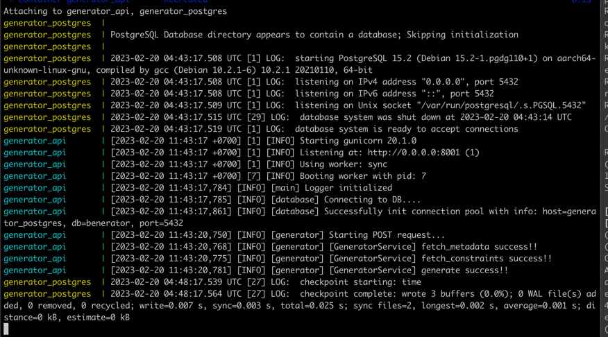

## Developing a server side xml-generator db schema application with Flask
### Created date: 2023-02-20
### Author: *Binh Lam*

# Environment Setup
1. Run the server-side with Virtualenv:

    ```sh
    cd db-challenge-resolve
    python3 -m venv dbchallenge_env
    source dbchallenge_env/bin/activate
    pip install -r requirements.txt
    ```
    * API RUN:
    ```sh
        cd ~/virtualenvs/dbchallenge_env/bin
        gunicorn --timeout 3000 --bind 127.0.0.1:8000 main:run()
    ```

2. Or run the server-side with Docker:
   ```sh
    cd db-challenge-resolve
    docker-compose --build
    ```
   

3. Sample curl:
   ```sh
   curl --location --request POST 'localhost:8000/api/v1/xml/generate'
   ```

4. Result:
   ```sh
   after run the curl above, result stored in: <your-path>/db-challenge-resolve/track/xml/result.xml
   ```
